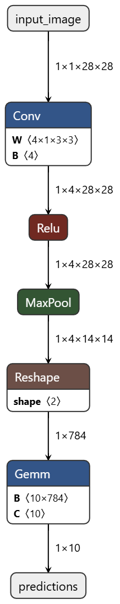
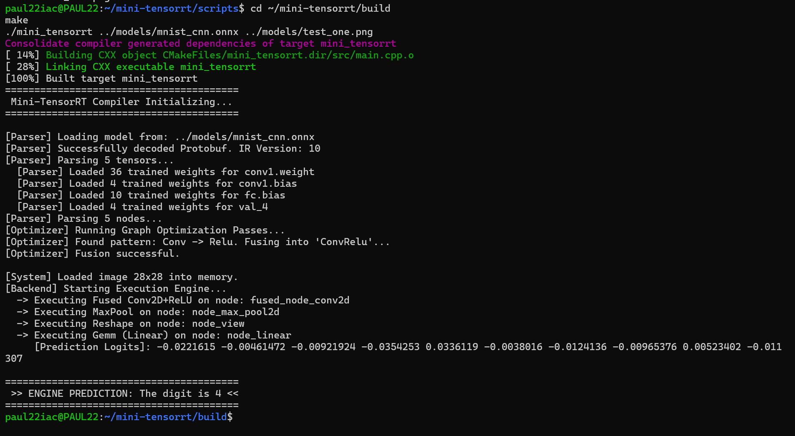

# Mini-TensorRT

Mini-TensorRT is a zero-dependency, optimizing deep learning inference engine written in C++. It serves as a custom inference compiler designed to explore the intersection of machine learning systems and hardware-software co-design. The engine ingests standard ONNX models, constructs a custom Intermediate Representation (IR) graph, applies middle-end compiler optimizations, and executes operations via a backend of manual C++ kernels.


*Visualizing the ingested ONNX topology prior to operator fusion.*

## Core Architecture

This engine operates independently of high-level frameworks like PyTorch or OpenCV, utilizing only C++17 and Google Protocol Buffers for model deserialization.

* **Frontend Parser:** A custom deserializer for binary ONNX files that extracts static shapes, graph topologies, and trained weights into a system-agnostic format.
* **Intermediate Representation (IR):** A graph-based management system using custom Tensor classes to handle NCHW data layouts and track execution dependencies.
* **Optimizing Compiler:** A graph-traversal middle-end that mutates the execution plan. It currently implements **Operator Fusion**, merging Convolution and ReLU layers into a single "super-kernel" to minimize DRAM round-trips.
* **Execution Engine:** A backend that performs dynamic shape inference and executes optimized kernels against real memory buffers.

## Performance Analysis: Operator Fusion

To quantify the impact of graph optimization, the engine was benchmarked on an MNIST CNN architecture. By fusing the feature extraction layers, the engine significantly reduced memory bandwidth overhead.

| Configuration | Conv Latency | ReLU Latency | Block Total |
| :--- | :--- | :--- | :--- |
| **Standard (Unfused)** | 183us | 98us | 281us |
| **Optimized (Fused)** | 211us | -- | **211us** |

**Results:** The optimization pass achieved a **25% reduction in latency** for the primary feature extraction block. This speedup is attributed to improved register utilization and the elimination of intermediate tensor writes to main memory.

## Supported Operators

The backend supports the necessary operations for end-to-end CNN inference:
* **Conv2D:** Spatial convolution with dynamic stride and padding support.
* **ReLU:** Element-wise non-linear activation.
* **ConvRelu:** Fused kernel for combined convolution and activation.
* **MaxPool:** Spatial downsampling for feature reduction.
* **Reshape:** Metadata-only tensor flattening.
* **Gemm:** General Matrix Multiplication for fully connected layers.

## End-to-End Inference

The engine supports raw image ingestion. Below is the terminal output of the engine parsing an MNIST model, optimizing the graph, and performing inference on a sample digit.



## Building and Running

### Dependencies
* CMake (>= 3.10)
* Make
* Protocol Buffers (`libprotobuf-dev`, `protobuf-compiler`)

### Build Instructions
```bash
mkdir build && cd build
cmake ..
make