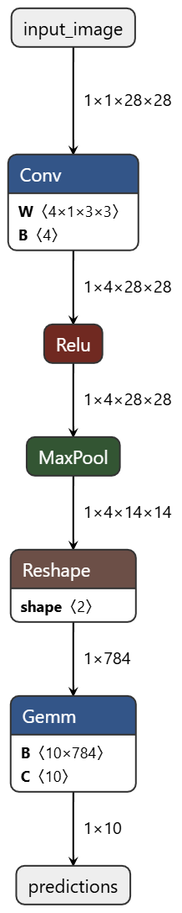

# Mini-TensorRT


Mini-TensorRT is an optimizing deep learning inference engine written from scratch in C++. It serves as a custom inference compiler designed to explore the intersection of machine learning systems and hardware-software co-design. The engine ingests standard ONNX models, constructs a custom Intermediate Representation (IR) graph, applies middle-end compiler optimizations, and executes operations via a backend of handwritten C++ kernels.

The bundled demo model is a small CNN trained to **93.2% accuracy on MNIST** — the engine genuinely recognizes handwritten digits, and its outputs **match ONNX Runtime's logits exactly** on the same inputs.

**[Try it in your browser](https://pauliacobucci.com/demo.html)** — the same kernels compiled to WebAssembly, classifying digits you draw (see `wasm/`).


*Visualizing the ingested ONNX topology prior to operator fusion.*

## Core Architecture

This engine operates independently of high-level frameworks like PyTorch or OpenCV, utilizing only C++17 and Google Protocol Buffers for model deserialization.

* **Frontend Parser:** A custom deserializer for binary ONNX files that extracts static shapes, graph topologies, and trained weights into a system-agnostic format. Supports both embedded (`raw_data`) and external-data tensors (weights stored in a sidecar `.data` file with offsets and lengths).
* **Intermediate Representation (IR):** A graph-based management system using custom Tensor classes to handle NCHW data layouts and track execution dependencies.
* **Optimizing Compiler:** A graph-traversal middle-end that mutates the execution plan. It currently implements **Operator Fusion**, merging Convolution and ReLU layers into a single "super-kernel" to eliminate the intermediate tensor round-trip through memory.
* **Execution Engine:** A backend of multi-channel NCHW kernels that perform dynamic shape inference and own their output allocation — shapes are read from the incoming tensors at execution time, never hardcoded.

## End-to-End Inference

The engine ingests a raw PNG, normalizes it, and runs the full pipeline. Below is the real output of the engine parsing the trained MNIST model, fusing Conv+ReLU, and classifying a handwritten "1":

```text
$ ./mini_tensorrt ../models/mnist_cnn.onnx ../models/test_one.png
========================================
 Mini-TensorRT Compiler Initializing...
========================================

[Parser] Loading model from: ../models/mnist_cnn.onnx
[Parser] Successfully decoded Protobuf. IR Version: 9
[Parser] Parsing 5 tensors...
  [Parser] Loaded 36 trained weights for conv1.weight
  [Parser] Loaded 4 trained weights for conv1.bias
  [Parser] Loaded 7840 trained weights for fc.weight (external: mnist_cnn.onnx.data)
  [Parser] Loaded 10 trained weights for fc.bias
  [Parser] Loaded 4 trained weights for /Constant_output_0
[Parser] Parsing 5 nodes...
[Optimizer] Running Graph Optimization Passes...
[Optimizer] Found pattern: Conv -> Relu. Fusing into 'ConvRelu'...
[Optimizer] Fusion successful.

[System] Loaded image 28x28 into memory.
[Backend] Starting Execution Engine...
  -> Executing Fused Conv2D+ReLU on node: fused_/conv1/Conv
  [Benchmark] ConvRelu latency: 53 us
  -> Executing MaxPool on node: /pool/MaxPool
  [Benchmark] MaxPool latency: 2 us
  -> Executing Reshape on node: /Reshape
  [Benchmark] Reshape latency: 0 us
  -> Executing Gemm (Linear) on node: /fc/Gemm
     [Prediction Logits]: -10.11 6.0378 -3.12288 -0.916664 -5.32405 -4.76078 -3.319 -3.89879 0.11338 -4.0096
  [Benchmark] Gemm latency: 31 us

========================================
 >> ENGINE PREDICTION: The digit is 1 <<
========================================
```

**Correctness:** running the same model and image through ONNX Runtime produces the identical logits (`-10.11, 6.0378, -3.1229, ...`) — the handwritten kernels are numerically exact, not approximate.

## Performance Analysis: Operator Fusion

Fusion is a *memory-bandwidth* optimization: it eliminates writing the convolution output to RAM only to immediately read it back for the activation. That predicts a scale-dependent payoff, and the measurements (medians over repeated runs, dynamic input shapes) confirm it:

| Input size | Unfused Conv + ReLU | Fused ConvRelu | Speedup |
| :--- | :--- | :--- | :--- |
| 28×28 (3.1K-element intermediate) | 56 us | 55 us | ~2% (fits in L1/L2 — nothing to save) |
| 768×768 (2.4M-element intermediate) | 47.8 ms | 42.4 ms | **11.2%** |

At 28×28 the intermediate tensor lives entirely in cache, so removing the round-trip buys almost nothing. At 768×768 the intermediate no longer fits, the eliminated DRAM traffic is real, and fusion delivers a measurable win. Reproduce the baseline with `MINITRT_NO_FUSION=1 ./mini_tensorrt <model> <image>`.

## Supported Operators

The backend supports the necessary operations for end-to-end CNN inference, all multi-channel NCHW:
* **Conv2D:** Spatial convolution over arbitrary input/output channels, with bias.
* **ReLU:** Element-wise non-linear activation.
* **ConvRelu:** Fused kernel for combined convolution and activation.
* **MaxPool:** 2×2 spatial downsampling across every channel.
* **Reshape:** Metadata-only tensor flattening.
* **Gemm:** General Matrix Multiplication for fully connected layers, with buffer-size validation to fail loudly instead of reading garbage.

## Building and Running

### Dependencies
* CMake (>= 3.10)
* Make
* Protocol Buffers (`libprotobuf-dev`, `protobuf-compiler`)

### Build Instructions
```bash
mkdir build && cd build
cmake ..
make
```

### Run Inference
```bash
./mini_tensorrt ../models/mnist_cnn.onnx ../models/test_one.png
```

### Retrain / Re-export the Demo Model
`scripts/export_full_cnn.py` downloads MNIST (raw IDX files, no torchvision needed), trains the small CNN for two epochs on CPU (~93% test accuracy), and exports an engine-compatible ONNX graph with external weight data:
```bash
cd scripts && python3 export_full_cnn.py
```
